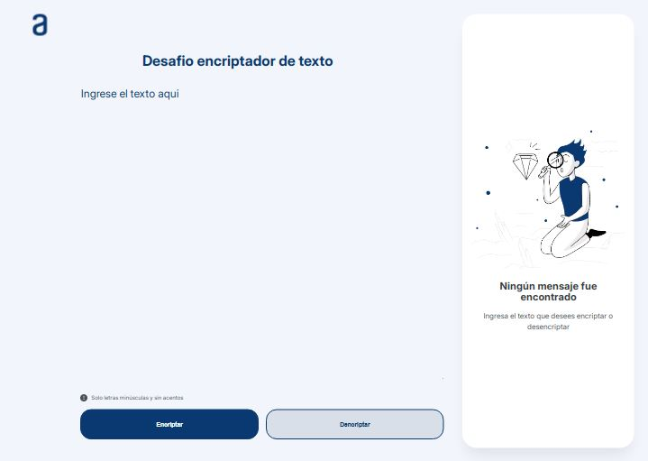

# 🔒 Encriptador de Texto


## Descripción 📄

Este proyecto es una aplicación web simple que permite encriptar y desencriptar texto según un conjunto específico de reglas de encriptación. 
La aplicación forma parte del primer Challenge, que pone a prueba los conocimientos adquiridos durante el curso "Principiante en programación" del ***Proyecto ONE*** de **Oracle+Alura LATAM.**


## Funcionalidades ✨

- **Encriptar Texto**: Convierte el texto ingresado en una versión encriptada utilizando las siguientes reglas:
  - La letra "e" se convierte en "enter".
  - La letra "i" se convierte en "imes".
  - La letra "a" se convierte en "ai".
  - La letra "o" se convierte en "ober".
  - La letra "u" se convierte en "ufat".
  
- **Desencriptar Texto**: Convierte un texto encriptado de vuelta a su versión original.

- **Validación del Texto**: Asegura que solo se acepten letras minúsculas sin acentos ni caracteres especiales.

- **Copiar al Portapapeles**: Permite copiar el texto encriptado o desencriptado para usarlo en otro lugar.

## Capturas de Pantalla 📸

### Pantalla Principal


## Tecnologías Utilizadas 🛠️

- **HTML5**: Para la estructura básica de la aplicación.
- **CSS3**: Para darle estilo y hacer que la interfaz sea atractiva y responsive.
- **JavaScript**: Para la lógica de encriptación, desencriptación y manejo de eventos.

## Instalación y Uso 🚀

1. Clona este repositorio:
   ```bash
   git clone https://github.com/NFabian-Parra/desafio_encritador.git

2. Navega al directorio del proyecto:
   ```bash
   cd encriptador-texto
   ```

3. Abre el archivo `index.html` en tu navegador favorito.

4. Ingresa el texto que deseas encriptar o desencriptar en el campo correspondiente.

5. Usa los botones para encriptar, desencriptar o copiar el resultado.

> **Nota**: Si no deseas descargar el repositorio, puedes probar el proyecto dando [clic aquí](https://nfabian-parra.github.io/desafio_encritador/).


## Contribuciones 🤝

¡Las contribuciones son bienvenidas! Si deseas mejorar este proyecto o añadir nuevas funcionalidades, siéntete libre de hacer un fork y enviar un pull request.

---

Desarrollado con ❤️ por [Nestor Fabian Parra](https://github.com/NFabian-Parra)
```
